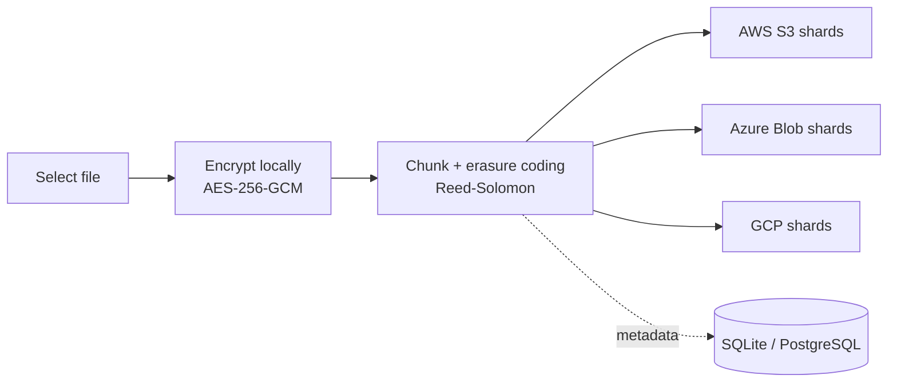
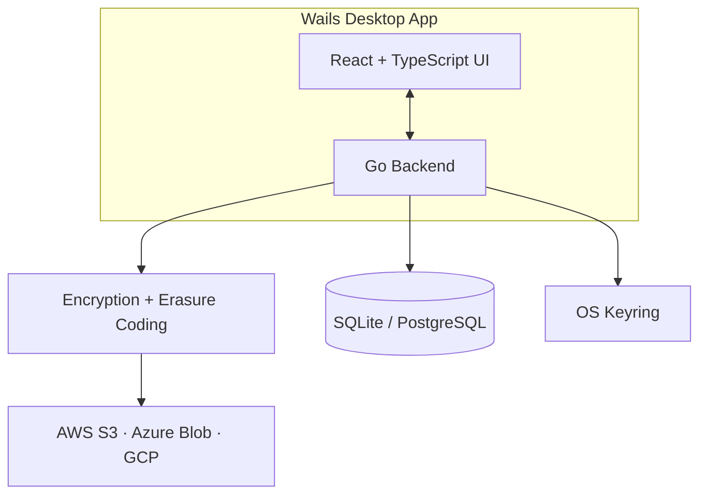

# Ayo

A privacy-first, Google-Drive-style desktop app. Ayo encrypts files on your device, splits them into chunks, and spreads them across multiple cloud providers you bring yourself (AWS S3, Azure Blob, GCP), so no single provider ever holds a complete, readable copy of your data.

## Capabilities

- End-to-end encryption: AES-256-GCM, keys never leave your machine
- **Streaming I/O**: Supports arbitrarily large files (5GB+) with constant ~128MB memory footprint
- Master key wrapped with Argon2id-derived KEKs (password + recovery key)
- Recovery-key based password reset
- File chunking + Reed-Solomon erasure coding (data + parity shards, e.g. 2+2 / 6+3 / 10+4 / 17+3)
- Multi-cloud distribution: AWS S3, Azure Blob, Google Cloud Storage
- Encrypted per-user settings stored in the OS keyring
- Bring-your-own database: local SQLite by default, or your own PostgreSQL (remote server or local)
- Desktop UI: upload, file listing, storage & erasure-coding settings

## How it works

1. Select a file → encrypted and chunked client-side
2. Reed-Solomon parity shards are generated
3. Shards are distributed across your configured providers
4. Metadata (shard locations, key material) stays in your database (local SQLite by default, or your own PostgreSQL)
5. On download, shards are reconstructed and decrypted on your device

## Architecture

## Tech stack

- Backend: Go 1.24, Wails v2
- Crypto: AES-256-GCM, Argon2id, bcrypt, per-user salts/nonces
- Database: SQLite (`modernc.org/sqlite`, pure Go, no cgo) by default, PostgreSQL (local or remote) for bring-your-own setups
- Keyring: zalando/go-keyring
- Frontend: React 18, TypeScript, Vite 3, Tailwind CSS, React Router, react-hook-form + Zod

## Current status

Ayo is in the early stages of development.

## Database selection

Each account picks its database at registration (tabbed choice in the sign-up form):

- **SQLite**: a local database file per user, auto-created in the OS app data
  directory (`~/Library/Application Support/ayo/<username>.db` on macOS).
- **PostgreSQL**: connect to your own server with user-provided credentials.

The credentials are encrypted in the OS keyring (dual-wrapped with the
password-derived and recovery-key-derived KEKs, the same pattern as the master
key), so password reset re-encrypts them automatically. The database choice is
permanent and shown read-only in Settings → Database.

> **Breaking change**: accounts created before this feature have no encrypted
> database-credentials entry in the keyring and cannot log in after upgrading.
> No automatic migration is provided.

## Getting started

- Dev: `wails dev` (Vite hot reload; browser dev server on http://localhost:34115)
- Build: `wails build` (produces `build/bin/ayo.app`)
